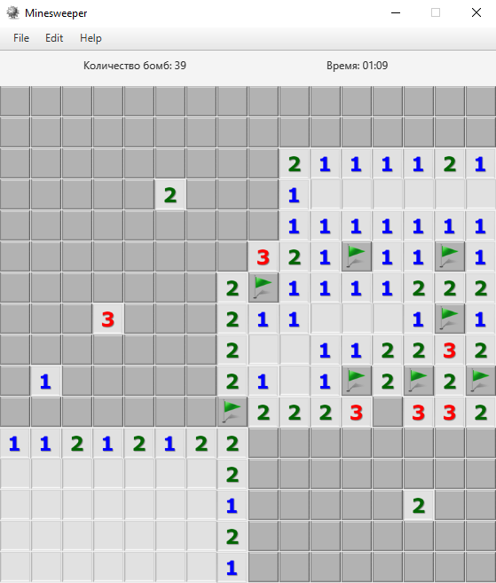

# game minesweeper


- [Installation](#anc1)
- [Usage](#anc2)
- [Contribution](#anc3)
- [Example of work](#anc4)

---
Game [Minesweeper](https://en.wikipedia.org/wiki/Minesweeper_(video_game)), which is implemented as a desktop application.</br>
Realisation by [Java 8](https://www.oracle.com/ru/java/technologies/javase/javase8-archive-downloads.html).
[JavaFX](https://openjfx.io/) was used to create a GUI.

<a id="anc1"></a>

## Installation
- The sources for application can be downloaded from the [Github repo](https://github.com/rrtty0/game_minesweeper.git).

* You can either clone the public repository:
```
        $ git clone https://github.com/rrtty0/game_minesweeper.git 
```
<a id="anc2"></a>

## Usage

- For use this application you must downloaded [JDK 1.8](https://www.oracle.com/ru/java/technologies/javase/javase8-archive-downloads.html)

<a id="anc3"></a>

## Contribution
1. _Clone repo_ and _create a new branch_:
```
        $ git clone https://github.com/rrtty0/game_minesweeper.git
        $ git branch name_for_new_branch
        $ git checkout name_for_new_branch
```
2. _Make changes_ and _test_
3. _Submit Pull Request_ with comprehensive description of changes

## Example of work

Application have two modes of game:

- Stage 8x8
- Stage 16x16

The goal of the game is to open all cells where there are no bombs.

---


---


---

